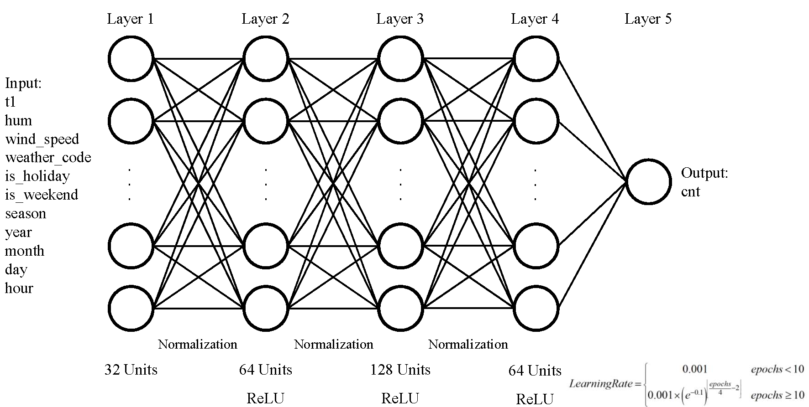
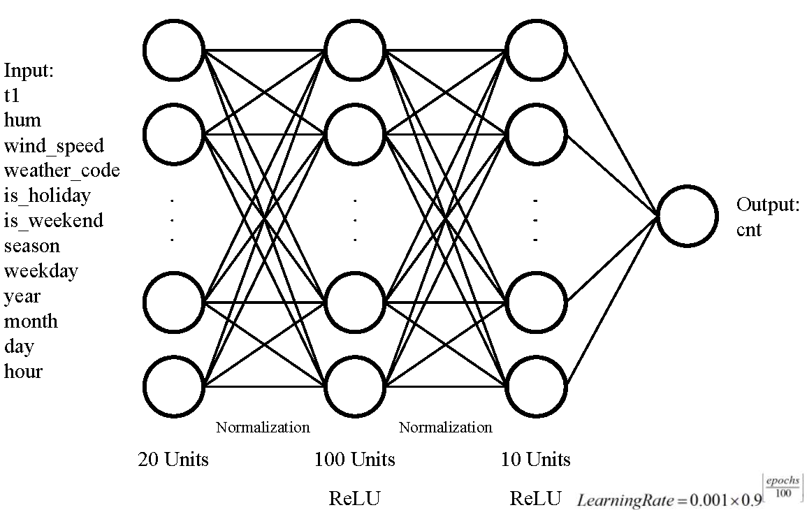
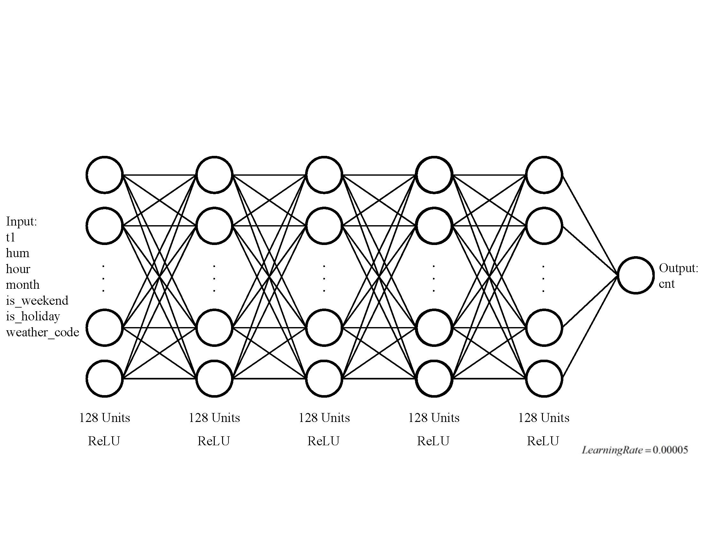

## The Models to Predict the Amount of Bike Sharing

### Regular Neural Network

Based on the exploratory data analysis, regular neural network is used to figure out the project.

The algorithm used for this problem is regular neural networks. Because of the low correlation between given features, neural network probably is the most appropriate model to solve the project. Neural network is a model that optimize the parameters through learning process to recognize hidden relationships between different data. Specific to this project, regular neural network is used. This model is used for similar predictions to predict a dependent variables based on independent variables, where the model is unlikely to be a linear regression model, unlike convolutional neural networks that are used for image classification, or recurrent neural networks that are used for prediction of future outcomes that are dependent on past data, like predicting the left life span of equipment, which is irrelevant for this problem as the new bike counts are independent of past bike counts, unless available bikes in a station in the previous hour was provided as a feature as literature have shown it can affect bike counts, however this information is not available in the dataset. However, another algorithm that is applicable for this problem is Random Forest Model, however this algorithm wasn’t used either. The reason regular neural network was preferred is because random forest has a few limitations. The main limitation of random forest is that a large number of trees is required to produce accurate predictions, but on the other hand, the higher the number of trees used in the model the slower it is [@https://builtin.com/data-science/random-forest-algorithm]. Moreover, in reference to Ashqar et al. (2019)[@doi:10.1016/j.cstp.2019.02.011], feature engineering in random forest becomes even more critical which adds another difficulty in improving accuracy of the model besides hyperparameters tuning.The architecture of regular neural network is shown in Figure @fig:regular-neural-network .

{#fig:regular-neural-network}

There are 4 steps to build and train neural network, including:

- Selecting features; 
- Data preprocessing; 
- Designing layers and parameters; 
- Determining training methods. 

We used different features, epochs, hidden layers, units and learning rates in this project. The architectures of our models are shown in Figure @fig:jingzi-model , @fig:anye-model and @fig:dana-model . The main parameters of our models are shown in Table @tbl:our-models

{#fig:jingzi-model}

{#fig:anye-model}

{#fig:dana-model}

| **Models** | **Features** | **Epochs** | **Hidden Layers** | **Units** | **Learning Rates** |
|:---------- |:---------:|:-------------:|:-------------:|:-------------:|:-------------:|
| Jingzi | 11 | <150 | 5 | 289 | Non-Constant |
| Anye |  12 | 300 | 4 | 131 | Non-Constant |
| Dana | 7 | 800 | 6 | 641 | Constant |
|*Epochs in Jingzi’s model will be stopped when loss reached the minimum. <!-- $colspan="6" --> | | | | | |
Table: The Overview of Our Models
{#tbl:our-models}

ReLU is used as activation function because ReLU is not only usually better than other activations like the sigmoid, but also easier to compute [@https://developers.google.com/machine-learning/crash-course] . The equation of ReLU is shown in equation @eq:relu

$$F(x)=max(0,x)$$ {#eq:relu}

The loss function and evaluation of the models’ performances are based on the root mean squared error(RMSE) between the test data and predictions. The equation of RMSE is shown in equation @eq:rmse .

$$ RMSE = \sqrt{\frac{1}{n}\Sigma_{i=1}^{n}{(observed_i - predicted_i)^2}}$$ {#eq:rmse}

In equation @eq:rmse , “n” is the number of predictions. “observed_i” and “predicted_i” is the observed cnt and the predicted cnt at each group of features. Thus, RMSE represents the differences between observations and predictions.

### Sensitivity Analysis

To evaluate and optimize our models, we analyzed the sensitivity of different parameters.

Units of Layers, Layers, Normalization and Learning Rates are analyzed. To avoid the influence of randomization, the evaluation of the performances is according to the average RMSE of 3 separate training with same initial parameters.

The architectures and main training methods of sensitivity analysis are shown in Table @tbl:units-setting , Table @tbl:layers-setting , Table @tbl:normalization-setting and Table @tbl:rates-setting .

| **Layer 1** | **Layer 2** | **Layer 3** | **Layer 4** | **Layer 5** | **Learning Rate** | **Normalization** |
|:--------- |:----------:|:---------:|:---------:|:---------:|:------------------:|:------------------:|
| 32 | 16 | 128 | 64 | 1 | Same with Jingzi | At each layer |
| 32 | 32 | 128 | 64 | 1 | Same with Jingzi | At each layer |
| 32 | 64 | 128 | 64 | 1 | Same with Jingzi | At each layer |
| 32 | 128 | 128 | 64 | 1 | Same with Jingzi | At each layer |
Table: The Sensitivity of the Number of Units in Layer 2
{#tbl:units-setting}

| **Layer 1** | **Layer 2** | **Layer 3** | **Layer 4** | **Layer 5** | **Learning Rate** | **Normalization** |
|:--------- |:----------:|:---------:|:---------:|:---------:|:------------------:|:------------------:|
| 32 | 64 | 128 | 64 | 1 | Same with Jingzi | At each layer |
| - | 64 | 128 | 64 | 1 | Same with Jingzi | At each layer |
| - | - | 128 | 64 | 1 | Same with Jingzi | At each layer |
Table: The Sensitivity of the Number of Layers
{#tbl:layers-setting}

| **Layer 1** | **Layer 2** | **Layer 3** | **Layer 4** | **Layer 5** | **Learning Rate** | **Normalization** |
|:--------- |:----------:|:---------:|:---------:|:---------:|:------------------:|:------------------:|
| 32 | 64 | 128 | 64 | 1 | Same with Jingzi | At each layer |
| 32 | 64 | 128 | 64 | 1 | Same with Jingzi | - |
Table: The Sensitivity of Normalization
{#tbl:normalization-setting}

| **Layer 1** | **Layer 2** | **Layer 3** | **Layer 4** | **Layer 5** | **Learning Rate** | **Normalization** |
|:--------- |:----------:|:---------:|:---------:|:---------:|:------------------:|:------------------:|
| 32 | 64 | 128 | 64 | 1 | Same with Jingzi | At each layer |
| 32 | 64 | 128 | 64 | 1 | Same with Anye | At each layer |
| 32 | 64 | 128 | 64 | 1 | 0.001 | At each layer |
| 32 | 64 | 128 | 64 | 1 | 0.005 | At each layer |
Table: The Sensitivity of Learning Rate
{#tbl:rates-setting}
