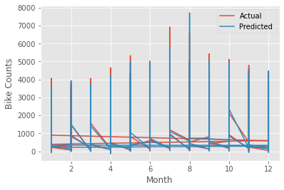
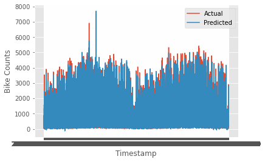

## Discussion

The three models obtained by the group members were compared and assessed. And the best-fitting model was used to predict bike counts in an hour for the test data and it resulted in the lowest denormalized RMSE equivalent to 210, however the other models had close RMSE as well. The selected model includes the following features: temperature, humidity, hour of the day, day of the month, month of the year, the year, weekend indicator, holiday indicator, weather code, season, & wind speed. To asses if the RMSE value is acceptable, we look at the scale of the bike-sharing system in London. Transport for London website shows that there are more than 11,500 bikes at over 750 docking stations across London. So 210 bikes error in estimation for all stations is equivalent to an overestimation of underestimation of bike rentals by 0.28 per station, which corresponds to 28% chance than 1 bike more or less will be used per station, assuming demand over stations is uniform since the dataset didn’t include information about where the bike counts where recorded in the city and in which station. In the paper by Ashqar et al. (2019) [@doi:10.1016/j.cstp.2019.02.011]. the mean prediction error (MPE) which is equivalent to the sum of the difference between predictions and actual values divided by total number of datapoints, varies between -1 and 2.2 per station, and in this case the MPE value we obtained is 0.28 per station, which means that the model has high prediction power. 

The purpose of this model is to predict the future bike share of London bike-sharing system. Since the demand is stochastic, regardless of how well the model performs there is always a level of uncertainty, so a range of the bike new counts is the objective for this problem. We observe that the mean of the training data is 1138 and the testing data led to a mean of 1124, which shows a good level of accuracy, with only 1.23% underestimation of the mean of bike counts. In another model the mean of the bike counts for the testing data was equivalent to 1167 which is equivalent to 2.54% overestimation of the mean. In some cases, overestimating the demand is preferred rather than underestimating the demand, thus both models can yield satisfactory predictions. Besides that the coefficient of determination (R-squared) has a value of 0.975 which is another validation that the model’s performance is satisfactory. The model can be used to predict number of bikes in a station per hour, which can be used to schedule bike rebalancing between stations or to design a new station and estimate the number of bikes required, however for this task additional dataset that includes distribution of the demand over stations is required. The level of accuracy achieved in this model, is appropriate to set shifts scheduling such that demand is met by ensuring a certain number of bikes is available at each station at a certain period during the day. Given the safety margin added in such operations to account for stochasticity of the demand, the model performance can be extremely efficient for such applications. However, it is not ideal to use this model for scheduling tight shifts in busy areas where the demand can shift drastically and the bike count per hour is the highest and more accuracy is needed given that this model assumes uniform demand over all stations. 

The actual bike counts of the testing data are not provided, so to compare the actual bike counts with the predicted bike counts, we use the validation data which constitutes about 30-40% of the training data chosen at random, and we predict the corresponding bike counts. Two plots are created using the actual bike and predicted bike counts with respect to the month Figure @fig:act_pred_mon, which shows that the average actual bike counts and predicted bike counts don’t vary significantly with respect to each month, same applies for the second plot Figure @fig:act_pred_time that plots the counts per timestamp which includes all the datapoints for all the hours in the validation data, and similarly we can see that the predictions have high accuracy. 

{#fig:act_pred_mon}

{#fig:act_pred_time}

Some of the limitations of the model lie in the data processing and hyperparameter tuning that can be even more improved with even bigger dataset. Using a dataset for a duration exceeding two years can even improve the model. Further hyperparameter tuning, adding more features such as stations locations, or using a different algorithm like random forest model or other types of neural networks.

Moreover, the performance of the model may have less prediction powers for other cities than London, where weather conditions have different effect and other weather features are needed to represent the weather such as thickness of snow in extreme cases where the threshold between acceptable weather conditions and extreme ones vary. In addition to that some other features that can be important for other locations might not be accounted for in this dataset and model, like holidays that differ between countries. Moreover the number of docks in station can also have an impact which influences the maximum number of bikes available in a station, and in paper [@doi:10.1016/j.cstp.2019.02.011], it was shown that the bike counts per hour is affected by the available bikes in stations in the previous hour, which is a good application of recurrent neural networks. Besides that, the testing data count is around 50% of the training data set, which suggests that bigger training data should be better for better accuracy, in addition to that more analysis to outliers of the test data can provide interesting insights about hidden features not accounted for in this dataset but that’s outside of the scope of this project.

## Conclusion

After interpreting the exploratory data analysis, a predictive model using regular neural networks through tensor flow package was created to predict range of bike counts in an hour. The features used in this model include: temperature, humidity, hour of the day, day of the month, month of the year, the year, weekend indicator, holiday indicator, weather code, season, & wind speed. In one of the models the final normalized root mean squared error of the model is 0.2058 and 0.25 for training data and validation data respectively, and in the best-fitting model the rmse for the training data was reduced to 0.1845. The model was later used to predict the bike counts in an hour for the test dataset. The mean of the predicted values is relatively similar to the mean of the training data with only 1.23% relative difference. Improvements to this model can be made by adding further features or performing additional hyperparameters tuning, however the predictive model obtained is satisfactory. This model can be used for scheduling redistribution shifts for bikes between stations in non-busy areas were demand is low and accuracy level is less critical given that the model predicts total number of bikes shared per hour in all London city, however for microscopic predictions, the model might not be as accurate given that demand per station might be modeled different and it can be influenced by different factors such the population distribution in the city and the land-use nearby stations. 
