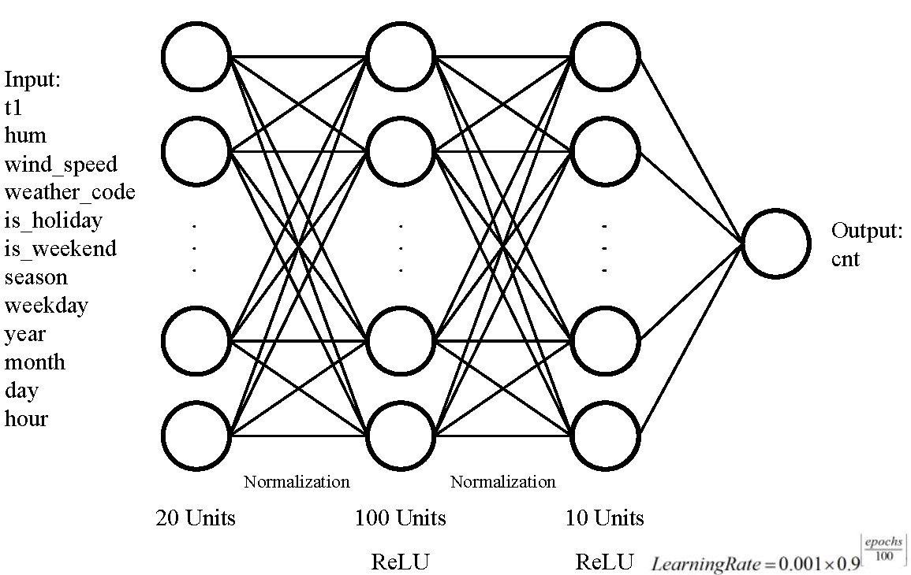
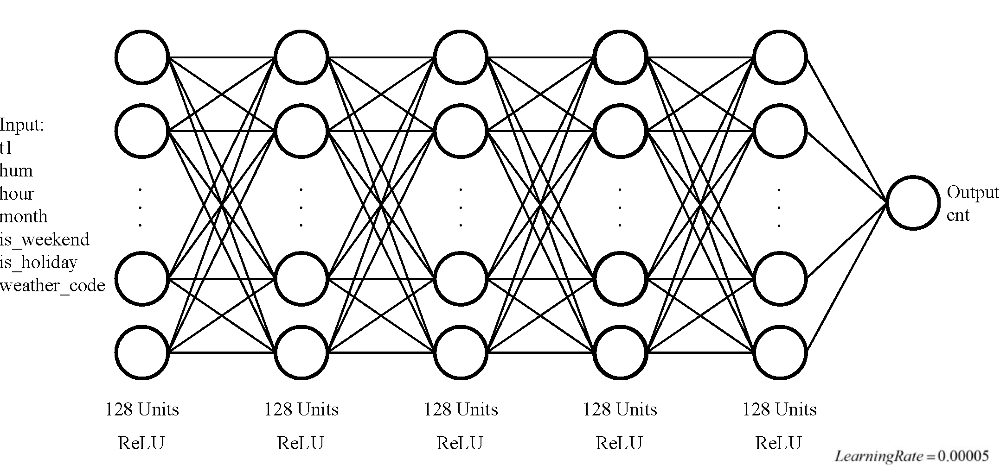

---
author-meta:
- Jingzi Chen
- Anye Wang
- Dana Monzer
bibliography:
- content/manual-references.json
date-meta: '2020-12-06'
header-includes: '<!--

  Manubot generated metadata rendered from header-includes-template.html.

  Suggest improvements at https://github.com/manubot/manubot/blob/master/manubot/process/header-includes-template.html

  -->

  <meta name="dc.format" content="text/html" />

  <meta name="dc.title" content="The Models of London Bike Sharing Prediction" />

  <meta name="citation_title" content="The Models of London Bike Sharing Prediction" />

  <meta property="og:title" content="The Models of London Bike Sharing Prediction" />

  <meta property="twitter:title" content="The Models of London Bike Sharing Prediction" />

  <meta name="dc.date" content="2020-12-06" />

  <meta name="citation_publication_date" content="2020-12-06" />

  <meta name="dc.language" content="en-US" />

  <meta name="citation_language" content="en-US" />

  <meta name="dc.relation.ispartof" content="Manubot" />

  <meta name="dc.publisher" content="Manubot" />

  <meta name="citation_journal_title" content="Manubot" />

  <meta name="citation_technical_report_institution" content="Manubot" />

  <meta name="citation_author" content="Jingzi Chen" />

  <meta name="citation_author_institution" content="Grainger College of Engineering, University of Illinois at Urbana-Champaign" />

  <meta name="citation_author_orcid" content="86-13522264917" />

  <meta name="citation_author" content="Anye Wang" />

  <meta name="citation_author_institution" content="Grainger College of Engineering, University of Illinois at Urbana-Champaign, Civil Engineering - Construction Management" />

  <meta name="citation_author_orcid" content="15409980880" />

  <meta name="citation_author" content="Dana Monzer" />

  <meta name="citation_author_institution" content="Grainger College of Engineering, University of Illinois at Urbana-Champaign, Civil Engineering - Transportation Systems" />

  <meta name="citation_author_orcid" content="0000-0002-4688-6359" />

  <link rel="canonical" href="https://Jingzi2020.github.io/CEE498_2020_G1/" />

  <meta property="og:url" content="https://Jingzi2020.github.io/CEE498_2020_G1/" />

  <meta property="twitter:url" content="https://Jingzi2020.github.io/CEE498_2020_G1/" />

  <meta name="citation_fulltext_html_url" content="https://Jingzi2020.github.io/CEE498_2020_G1/" />

  <meta name="citation_pdf_url" content="https://Jingzi2020.github.io/CEE498_2020_G1/manuscript.pdf" />

  <link rel="alternate" type="application/pdf" href="https://Jingzi2020.github.io/CEE498_2020_G1/manuscript.pdf" />

  <link rel="alternate" type="text/html" href="https://Jingzi2020.github.io/CEE498_2020_G1/v/a5d8ed67634c7965f6d1b285187af3c8b5b69bfc/" />

  <meta name="manubot_html_url_versioned" content="https://Jingzi2020.github.io/CEE498_2020_G1/v/a5d8ed67634c7965f6d1b285187af3c8b5b69bfc/" />

  <meta name="manubot_pdf_url_versioned" content="https://Jingzi2020.github.io/CEE498_2020_G1/v/a5d8ed67634c7965f6d1b285187af3c8b5b69bfc/manuscript.pdf" />

  <meta property="og:type" content="article" />

  <meta property="twitter:card" content="summary_large_image" />

  <link rel="icon" type="image/png" sizes="192x192" href="https://manubot.org/favicon-192x192.png" />

  <link rel="mask-icon" href="https://manubot.org/safari-pinned-tab.svg" color="#ad1457" />

  <meta name="theme-color" content="#ad1457" />

  <!-- end Manubot generated metadata -->'
keywords:
- Neural Network
- Transportation
- Bike Sharing
lang: en-US
manubot-clear-requests-cache: false
manubot-output-bibliography: output/references.json
manubot-output-citekeys: output/citations.tsv
manubot-requests-cache-path: ci/cache/requests-cache
title: The Models of London Bike Sharing Prediction
...


<small><em>
This manuscript
([permalink](https://Jingzi2020.github.io/CEE498_2020_G1/v/a5d8ed67634c7965f6d1b285187af3c8b5b69bfc/))
was automatically generated
from [Jingzi2020/CEE498_2020_G1@a5d8ed6](https://github.com/Jingzi2020/CEE498_2020_G1/tree/a5d8ed67634c7965f6d1b285187af3c8b5b69bfc)
on December 6, 2020.
</em></small>

## Authors


+ **Jingzi Chen**<br>
    {.inline_icon}
    [86-13522264917](https://orcid.org/86-13522264917)
    · {.inline_icon}
    [Jingzi2020](https://github.com/Jingzi2020)<br>
  <small>
     Grainger College of Engineering, University of Illinois at Urbana-Champaign
  </small>

+ **Anye Wang**<br>
    {.inline_icon}
    [15409980880](https://orcid.org/15409980880)
    · {.inline_icon}
    [wanganye123](https://github.com/wanganye123)<br>
  <small>
     Grainger College of Engineering, University of Illinois at Urbana-Champaign, Civil Engineering - Construction Management
  </small>

+ **Dana Monzer**<br>
    {.inline_icon}
    [0000-0002-4688-6359](https://orcid.org/0000-0002-4688-6359)
    · {.inline_icon}
    [Dana2021](https://github.com/Dana2021)<br>
  <small>
     Grainger College of Engineering, University of Illinois at Urbana-Champaign, Civil Engineering - Transportation Systems
  </small>


## Abstract {.page_break_before}
The aim of this study is to create a predictive model for bike-sharing counts in an hour in the city of London in United Kingdom. The model makes use of regular neural networks. And the main features affecting the bike counts include weather conditions and time variables. The model's root mean square is 210, with a mean of 1124 counts in an hour for testing data compared to 1138 counts in an hour in the training data. The model provides enough accuracy for planning the number of docks at a new station and scheduling bike redistribution schedules between stations.


## Introduction


Bike-sharing system is an important mode in sustainable transportation modes. Great attention is put to improve such systems to increase their demand and maximize their environmental benefits along with other societal benefits. To study the demand of this system, London Bike-sharing system sis explored. The purpose of this study is to predict ranges of new bike counts each hour based on certain factors provided in the dataset. 
The aim of this report is to create a predictive model using machine learning to predict bike counts in a given hour in London city which is useful for planning and operation forecasting of bike-sharing system. The exploratory data analysis using graphical and statistical tools in Python were used to derive preliminary conclusions about the dataset by analyzing the results of the tools used. 
The dataset provided was acquired from three sources, to include the new bike counts in each hour, the weather conditions, and the holidays. 
The data from cycling dataset is grouped by "start time", and it represents the count of new bike shares grouped by hour. The long duration shares are not taken in the count.”
The data sample analyzed in this project is collected between January 1st, 2015 to January 1st, 2017 in London, UK and it includes the following parameters:
-	Timestamp (year, month, day, hour)
-	Cnt:  the count of a new bike shares
-	T1: temperature measure taken in degree Celsius
-	T2: temperature feels 
-	Hum: humidity percentage
-	Wind_speed: in Km/hr 	
-	Weather_code: 1 = Clear ; mostly clear but have some values with haze/fog/patches of fog/ fog in vicinity 2 = scattered clouds / few clouds 3 = Broken clouds 4 = Cloudy 7 = Rain/ light Rain shower/ Light rain 10 = rain with thunderstorm 26 = snowfall 94 = Freezing Fog
-	Is_holiday: 1 if it is a holiday, 0 if it is not. 
-	Is_weekend: 1 if it is a weekend, 0 if it is not. 	
-	Season: 0: Spring, 1: Summer, 2: Fall, 3: Winter
The sections below include literature review, description of methods, results, discussion and conclusion. 


## Literature Review

Bike sharing system has appeared more and more on the street of the cities in order to meet the demand of public transportation in the last short distance to the destination. Also, Bike sharing system is so popular around all the world that most of major modern cities and campuses have been operated. Among researches for the bike system, predicting the demand of future bike shares is one of the most important and necessary tasks to ensure a satisfactory level of service of the system. 

Many recent studies have focused on the problem of predicting demand of shared bikes in the system. In order to complete prediction, the bike sharing system is supposed to satisfy the real-time and high accuracy requirements. Some researchers utilized Spark Machine Learning framework to predict the number of rental bikes to optimize the accuracy of model [1]. Firstly, the author collected three types of data including Citi Bike, Weather and Holiday, which the data have been SQL and outlier processed. Then, three predicative models including multiple linear regression, decision tree and random forests are constructed to analyze and train the processed data. During the experiment, applying to machine learning Spark ecosystem, the author used 70 % data as training data while 30% as the test data. In the result, after testing, random forests model has the lowest root mean error (RMSE). At last, the researcher optimized the result further by applying logarithmic optimization to the model. 

Throughout the literatures, there is consistent evidence that forecast number of shared bikes are influenced not by holiday, weather, and temperature [2] in general, but by user information such as gender, birth year and user type [1]. The strengths of the literature are that the author consider more factors like user information and process useful and reasonable row data. Moreover, the optimization improves the accuracy the result. While there has been much research on algorithm optimization, few researchers have taken the influence of different factors and the real-time data into consideration [2]. The weakness of the literature is that the author ignored the timeliness of data and station selection. Furthermore, the mythology is limited to predict the number in the new area where lack of the existing shared bike number. Usually, station clustering and demand prediction in every station should be evaluated and analyzed as an integration [3]. 

In general, it is challenging to collect the external factors in the future study because there are too many factors affecting users whether to use shared bike. However, we should consider multiple factors as much as possible to improve the accuracy. Comparing with our project’s database, more factors are taken into consideration including time, number of new bike shares grouped by hour, temperature, humidity, wind speed, types of the weather, holiday, weekend, season [4]. In our project, we will employ historical usage of bikes with some necessary factors to predict the number, which are very similar with the literature because it is easier to collect data and the predicted numbers are closer to the real.


The second paper studied is  “Case Studies on Transport Policy Modeling bike counts in a bike-sharing system considering the effect of weather conditions” [5].  This paper identifies a method to quantify the effect of weather conditions on bike sharing counts in San Francisco Bay area with the aim of improving bike sharing systems given their wide benefits such as decreasing transportation pollution and increasing mobility efficiency in cities, to name a few. The benefit of this model specifically will be to decrease the environmental costs and time consumption and other complications associated with the rebalancing operation of bikes between stations; which is important to ensure that each station has enough number of bikes to satisfy the demand, especially given the limited number of docks at station. 

The methodology used to create the bike count model includes several steps. First the effect of various variables is quantified (month of the year, day of the week, time of the day and different weather conditions), then these predictors were ranked by Random Forest technique and were used to predict a regression model using a guided forwarded step-wise regression. More than one model was created then the Bayesian information criterion was used to evaluate the models. In the first step, the count models employed generalized linear models, specifically two models were used Poisson, which condition to apply is that the mean and variance must be equal, and negative binomial regression, which uses same condition as Poisson except that another parameter is involved that loosens the initial condition and adjusts the variance independently, so it is considered to accommodate more dispersion. The second step after that is to apply machine learning to avoid overfitting of predictors, using Random Forrest method. The RF method randomly constructs a group of trees, where each tree is a subset of features, so trees are not correlated, then the ranking of features is obtained based on majority of votes from all trees, after that forward step-wise regression is applied, and finally a model is selected BIC after computing the log-likelihood of each model, and the model of the lowest BIC is to be selected. 

This methodology [5] was applied on a dataset of bike-sharing for San Francisco Bay Area between August 2013 to August 2015, where incidents were documented every minute for 70 stations in the area, which led to a large dataset, and another dataset was used which included weather conditions during these 2 years, and it included the following attributes: “date (in month/day/year format), ZIP code, temperature, humidity, dew level, sea level pressure, visibility, wind speed and direction, precipitation, cloud cover, and weather description for that day (i.e., rainy, foggy or sunny).” 

For the first step, the histogram of new counts frequency for all stations showed dispersion, which gave a hint on better fitness of NBRM. However, both PRM and NBRM were applied at first to generate a full model of all available predictors. Then RF was used to rank the predictors in the full model based on the OOB error. Forward stepwise regression was then used to fit several models that were constructed by RF, then BIC was applied to select the best subset of predictors to construct this model. 
At first it was assumed that there is no interaction between the 70 stations, to quantify effects fast and effectively and in an attempt to create one model for all variables rather than a model for each station, and this approach was described to satisfy the level of accuracy needed. And the results showed a logarithmic mean of bike counts at each station following parallel hyperplanes, which shows no interaction between stations. And in order to construct one model instead of 70 models, one for each station: 69 indicators were used with one reference, a similar approach was used for months of year with 11 indicators and January as a reference, and 6 indicators for the days of the week, and so on for all data attributes. If there was no significant difference between each pair of parameters, for example between 2 stations, it was assumed bike count was the same for the two stations to an acceptable level of accuracy. 
The results showed that different stations, month-of-the-year, day-of-the-week, and time-of-the-day were all shown to influence the model. And the following weather attributes were selected for additional exploration: mean temperature, mean humidity, mean visibility, mean wind speed, precipitation, and weather description. And for the second time, RF and forward step-wise regression were employed and the resulting models were compared by BIC. And the model with the trade-off between the minimum BIC value and the consideration of the effective parameters was selected. And as was shown because of dispersion, indeed NBRM was shown to be better than PRM, and it was selected for the rest of the modeling steps. 
Among 111 models created, the results showed that bike counts are significantly influenced by the month-of-the-year, day-of-the-week, time-of-the-day, and some weather variables, mainly temperature and humidity level, which is also dependent on geographic location. And the most significant variables affecting bike counts are available number of bikes at time t-1 and the time-of-the-day. 

This paper holds many strengths in meeting our project, first the factors used in this paper match our dataset, and the paper justifies the use of these factors among others used in other studies. And this paper was the first to study the effect of humidity which was shown to have a significant effect on the model. The methodology and tools used match our set of expertise, which is to be developed through this course, and the tools and methods used were all explained and justified. This paper can be used as a reference for us to build our model and compare the results given different factors, especially difference in geographic location, while also contributing to this research with the insights we obtain. 

However, a few weaknesses of this paper were detected. First, the paper targets only docked bike-sharing model and it’s applicable to only certain geographic areas with certain weather conditions, as for another location, different parameters might be additionally considered. The final stages of refining the model and detecting possible errors was merely systematic and rather relied on observations and experts opinions, so in addition to the scientific and sequenced steps, there was some subjectivity in the methodology when it comes to certain decisions like the number of trees in RF and the selected factors for each tree and their number which wasn’t discussed and explained enough, so it might be hard for us to follow the same methodology at these stages. The paper only used Poisson and negative binomial models at the first stage and didn’t attempt more complex distributions. And the paper chose the final model prioritizing simplicity, designated by a smaller number of predictors, among the last two proposed models, without explicitly comparing their levels of accuracy. And some standard values of comparisons for example minimum log-likelihood and typical BIC measures weren’t shared in the paper.


Another study published by  Lin, Wang,  Jiang, Fan and  Sun (2017) [6], tried to figure out sharing bike demand's prediction based on the Bayesian classifier and APSO-BP neural network models. In this article, the researchers collected weather data and historic public bicycle sharing record to build the dataset. Then, the model categorize bicycle rental mode through Bayesian classifier and used the specific neural network fitted to the mode. The evaluation of this model was based on its accuracy and the result was that the model showed higher accuracy than other algorithms.
To find the valuable factors of bike rental prediction, the article discussed the influence of holiday, weather and temperature and decided to build the dataset with these significant factors. The article set “di” as 1, 2 and 3 representing weekday, the first half of holiday and the second half of holiday, “wi” as 1, 2 and 3 as different weather and “ti” as different ranges of temperature.
To classify different situation of bike rental, the authors used cluster analysis to analyze the modes of bike rental record in training dataset. Through K-means cluster analysis, the bike rental behaviors were divided into 4 modes. Then, the researchers built the classifier using training dataset through Bayes classification method.
Then, the article designed an APSO-BP neural network model to forecast the bike rental demand. APSO-BP used single hidden layer neural network model. APSO algorithm generated several particles which are feasible answers randomly at first. The algorithm used the squared error to evaluate fitness. The researchers trained separated ASPO-BP neural network for each mode.
The experiment of this research was based on the bike rental record and the weather data in Hangzhou from March 18 to June 15 in 2016. 5 minutes were chosen as the time range. The researchers categorize the training dataset into 4 modes through K-means cluster analysis and then trained ASPO-BP neural network for each mode. The result showed that the accuracy of the demand predicted by this method was influenced by the accuracy of classification and the accuracy of this method in predicting rental demand was higher than other common methods.
From this research, I learned that the factors should be transferred into reasonable values firstly and the method of transferring the data are diverse. Besides, the simple neural network models sometimes cannot solve the problem accurately. The combination of different algorithm are needed. Moreover, there are many optimized methods thus researchers should choose the most suitable optimized method to improve the accuracy. These tips can be useful for our project.


# Exploratory Data Analysis
## Introduction
Exploratory Data Analysis is vital and necessary before we start to create a training model because it helps us to realize and evaluate the both the features of data and their correlation with each other. There are five main tools were used to describe the dataset. 

**Scatterplots**

The reason for using scatter plots is to observe relationships between each pair of variables. Each dot in a scatter plot reports the values of individual data point, all the datapoints when plotted can help us identify a pattern that can show whether a relationship can be derived between two variables. This tool will help us decide which pairs of variables to explore further through other tools. Each pair of variables will have two plots. 

**Boxplots**

The reason for using box plots is to provide a visual summary of the data enabling us to visualize the median and range values, the dispersion of the data set, and any signs of skewness. So we can compare dispersion of new bike counts with respect to different values of a parameter. This tool will be used to explore certain relationships further than scatterplots, and not for all pairs of parameters. 
A box plot includes five values: the minimum value, the 25th percentile (Q1), the median, the 75th percentile (Q3), and the maximum value. 

**Multivariate Point Plots** 

The reason multivariate point plots are used is to shows us the effect of certain variables on the distribution of the new bike counts during the day. So we can obtain different plots depending on the other variable, so we can explore two variables interrelations. And we choose categorical variables to find how their different categories affect the change in new bike counts along a day. 

**Statistical Values**

The reason for finding statistical values is get an insight about the mean, range and maximum and minimum values of different parameters especially new bike counts, and make a connection with the visualizations created. If the dataset included more than 2 years, a good approach would have been to also find covariance between datapoints in different years to identify any change in pattern resulting from certain events associated with a certain year, but this is not needed in our case. 

**Correlation Matrix**

The reason for using correlation matrix is to identify correlation between all parameters in the dataset and the ones affecting new bike counts only. This is important for the predictive model, so we understand and interdependencies between predictors and to avoid multicollinearity. 
Correlation values range between -1 and 1., positive values indicate positive correlation and negative values indicate negative correlation.  Absolute Values above 0.7 generally indicate high positive correlation, between 0.5 and 0.7 is moderate and between 0.3 and 0.5 is low, while under 0.3 is negligible correlation. 

## Data Visualization

**Scatterplots** 

<!-- I don't know if you wanna add plots here -->

By looking at the plots we observe the following:
- 1- t1 and t2 are linearily dependent, which is expected because temperature feel directly depends on temperature.
- 2- Wind_speed and t2 seem to have some kind of relationship, which needs to be explored further
- 3- t1 and t2 have some kind of relationship with humidity, which needs to be explored further.
- 4- t1, t2, humidity and wind speed have some kind of relationship with cnt, which needs to be - explored further.
- 5 - Weather code and cnt have some kind of relationship.
- 6- Cnt seems higher when is_holiday is 0 (so when it is not a holiday)
- 7- Cnt seems higher when is_weekend is 0 (so during weekdays)
- 8- Cnt seems higher for weather codes (0-9)
- 9- Cnt seems higher for season 1 (summer), then similar for seasons 0 and 2 and lowest for season 3 (winter). 
- 10- Cnt seems highest for month 7,9,8,5 (expected based on observation 9)
- 11- It doesn't seem a certain pattern can be derived for effect of day on cnt. 
- 12- Cnt seems to have a relation depending on hour that can be explored further and it seems to be a multi-peak distribution

The observations above allow us to build hypthesis that can be explored further using other EDA tools which will lay down the basis of our predictive model.

**Boxplots**


Graph1 shows that: 
- 1- There seems to be a distribution of the median (middle line of the boxplot) and range (of the black line of each boxplot) of cnt with respect to month, it roughly follows a normal ditribution, peaking in July. 
- 2- For each month the distributions tends to be skewed to the right.
- 3- Months with lowest ranges are January, February, November and December. 
- Graph2 shows that:
- 1- There is no clear distribution of median of cnt over the hours of the day, but the variation shows that cnt varies between different hours in the day, which seems to have two peaks, around 8 am then around 5 pm. 
- 2- During some hours, the shape of the distribution of cnt tends to be normal, while it's more skewed to the right for some other hours. 
- 3- As expected night hours have the lowest cnt. 

**Multi-variate Plots**


- Graph1 shows the general plot of new bike counts over the hours of the day. 
- Graph2 provides interesting insight as it shows that the distribution of the counts during the day is different on a holiday is at peaks around 1 pm - 2pm, while during regular days, it has two peaks around 8 am and 5 pm, which follows the governing distribution and was shown in the boxplots as well. 
- Graph 3 shows similar results for weekends as holidays and for weekdays as non-holiday days
- Graph 4 shows that the seasons order based on highest bike counts is summer, then fall and spring, and then winter, which validates more clearly previous results. 
- Graph 5 shows high effect of weather in general, which is significant for codes 10 and 26 (10 = rain with thunderstorm, 26 = snowfall), implying no counts occur in such extreme cold weathers. 

**Statistical Values**


This gives us general insight about the mean and range of each parameter but it's irrelevant for time parameters. The main outcomes is that the values of cnt in each hour over the two years of study, have a mean of 1138 and standard deviation of 1079, which is almost equivalent to the mean which means that there is significant difference between cnt values in certain hours than others. And this was indeed shown in the visualizations. We also notice that the maximum value is 7860, almost 7 times as big as the mean, which also means that there are very relatively few hours with such high values that they didn't affect the mean significantly. However this might be also affected by the fact that we the datapoints include records along the day including night time, were people are not using bikes or commuting at all. We notice the temperature values range between -1.5 and 34 degrees C, which might not be representative of others cities; same applies to teh humidity and wind speed. So it's important to highlight this factor when representing the predictive model at later stage. 

## Correlation Matrix 


We can follow the color map to find the variables of some correlation, which are the variables with correlation above roughly above 0.3, which are colored by red or lighter shade of color or less than -0.3, which are colored in black . As expected t1 and t2 have high correlation which means only variable might be included in the predictive model at most. 

  - cnt shows correlation to t1 & t2 & humidity and hour of the day. 
  - t1 and t2 show correlation to cnt, humidity, and month of the year. 
  - humidity shows correlation to cnt, t1 & t2, and weather code
  - wind speed shows correlation to slightly to humidity 
  - weather code shows correlation to humidity 
  - holidays binary doesn't show correlation to any other parameter
  - weekend binary doesn't show correlation to any other parameter
  - season shows correlation to t1 & t2, humidity
  - month shows correlation to t1 & t2
  - day of the month doesn't show correlation to any other parameter
  - hour shows correlation to cnt and humidity

## Discussion
To summarize the results and analysis.The scatterplots showed that t1 and t2 are directly related, and possible relationship between wind speed and t2, t1 and humidity, humidity and bike counts, bike counts and wind speed, bike counts and temperature, weather code and bike counts. It also shows that bike counts are higher during weekdays and non-holidays and for better weather conditions. Also, it shows that highest counts occur for summer. And no pattern was shown between counts and day of month. The boxplots showed that there seems to be a distribution of counts based on month, and that the counts are mostly skewed to the right. Also, that the distribution of counts over the hours of the day have two peaks, and within the hour the distribution is mostly normal but for some hours it is skewed to the right. Multi-variable point plots show interesting insights about the change of the variation of counts over the day from bi-modal, for regular days and weekdays, to unimodal for holidays and weekends. And it also showed that although summer has highest counts and winter has the lowest, fall and spring seem to have similar values. And the correlations showed that new counts are mainly correlated to temperature, humidity and hour of the day with no significance correlation to other parameters. And some of the other parameters are correlated as well especially weather attributes (humidity, temperature, wind speed..).

We can derive several conclusions from the results of the exploratory data analysis. We explored which factors have a direct relationship with the new bike counts registered each hour, and the results show that the main factors affecting the range of new bike counts in an hour are temperature, humidity, and hour of the day, with some effect shown in visualizations by the weekdays, weather description, month and season. 


## The Models to Predict the Amount of Bike Sharing

### Regular Neural Network

Based on the exploratory data analysis, regular neural network is used to figure out the project.

Neural network is a model that optimize the parameters through learning process to recognize hidden relationships between different data. 

Because of the low correlation between given features, regular neural network probably is the most appropriate model to solve the project. The architecture of regular neural network is shown in Figure @fig:regular-neural-network .

{#fig:regular-neural-network}

There are 4 steps to build and train neural network, including:

- Selecting features; 
- Data preprocessing; 
- Designing layers and parameters; 
- Determining training methods. 

We used different features, epochs, hidden layers, units and learning rates in this project. The architectures of our models are shown in Figure @fig:jingzi-model , @fig:anye-model and @fig:dana-model . The Main parameters of our models are shown in Table @tbl:our-models

{#fig:jingzi-model}

{#fig:anye-model}

{#fig:dana-model}

| **Models** | **Features** | **Epochs** | **Hidden Layers** | **Units** | **Learning Rates** |
|:---------- |:---------:|:-------------:|:-------------:|:-------------:|:-------------:|
| Jingzi | 11 | <150 | 5 | 289 | Non-Constant |
| Anye |  12 | 300 | 4 | 131 | Non-Constant |
| Dana | 7 | 800 | 6 | 641 | Constant |
|*Epochs in Jingzi’s model will be stopped when loss reached the minimum. <!-- $colspan="6" --> | | | | | |
Table: The Overview of Our Models
{#tbl:our-models}

*Epochs in Jingzi’s model will be stopped when loss reached the minimum.

The evaluation of the models’ performances are based on the root mean squared error(RMSE) between the test data and predictions. The equation of RMSE is shown in equation @eq:rmse .

$$ RMSE = \sqrt{\frac{1}{n}\Sigma_{i=1}^{n}{(observed_i - predicted_i)^2}}$$ {#eq:rmse}

In equation @eq:rmse , “n” is the number of predictions. “observed_i” and “predicted_i” is the observed cnt and the predicted cnt at each group of features. Thus, RMSE represents the differences between observations and predictions.

### Sensitivity Analysis

To evaluate and optimize our models, we analyzed the sensitivity of different parameters.

Units of Layers, Layers, Normalization and Learning Rates are analyzed. To avoid the influence of randomization, the evaluation of the performances is according to the average RMSE of 3 separate training with same initial parameters.

The architectures and main training methods of sensitivity analysis are shown in Table @tbl:units-setting , Table @tbl:layers-setting , Table @tbl:normalization-setting and Table @tbl:rates-setting .

| **Layer 1** | **Layer 2** | **Layer 3** | **Layer 4** | **Layer 5** | **Learning Rate** | **Normalization** |
|:--------- |:----------:|:---------:|:---------:|:---------:|:------------------:|:------------------:|
| 32 | 16 | 128 | 64 | 1 | Same with Jingzi | At each layer |
| 32 | 32 | 128 | 64 | 1 | Same with Jingzi | At each layer |
| 32 | 64 | 128 | 64 | 1 | Same with Jingzi | At each layer |
| 32 | 128 | 128 | 64 | 1 | Same with Jingzi | At each layer |
Table: The Sensitivity of the Number of Units in Layer 2
{#tbl:units-setting}

| **Layer 1** | **Layer 2** | **Layer 3** | **Layer 4** | **Layer 5** | **Learning Rate** | **Normalization** |
|:--------- |:----------:|:---------:|:---------:|:---------:|:------------------:|:------------------:|
| 32 | 64 | 128 | 64 | 1 | Same with Jingzi | At each layer |
| - | 64 | 128 | 64 | 1 | Same with Jingzi | At each layer |
| - | - | 128 | 64 | 1 | Same with Jingzi | At each layer |
Table: The Sensitivity of the Number of Layers
{#tbl:layers-setting}

| **Layer 1** | **Layer 2** | **Layer 3** | **Layer 4** | **Layer 5** | **Learning Rate** | **Normalization** |
|:--------- |:----------:|:---------:|:---------:|:---------:|:------------------:|:------------------:|
| 32 | 64 | 128 | 64 | 1 | Same with Jingzi | At each layer |
| 32 | 64 | 128 | 64 | 1 | Same with Jingzi | - |
Table: The Sensitivity of Normalization
{#tbl:normalization-setting}

| **Layer 1** | **Layer 2** | **Layer 3** | **Layer 4** | **Layer 5** | **Learning Rate** | **Normalization** |
|:--------- |:----------:|:---------:|:---------:|:---------:|:------------------:|:------------------:|
| 32 | 64 | 128 | 64 | 1 | Same with Jingzi | At each layer |
| 32 | 64 | 128 | 64 | 1 | Same with Anye | At each layer |
| 32 | 64 | 128 | 64 | 1 | 0.001 | At each layer |
| 32 | 64 | 128 | 64 | 1 | 0.005 | At each layer |
Table: The Sensitivity of Learning Rate
{#tbl:rates-setting}


This manuscript is a template (aka "rootstock") for [Manubot](https://manubot.org/ "Manubot"), a tool for writing scholarly manuscripts.
Use this template as a starting point for your manuscript.

The rest of this document is a full list of formatting elements/features supported by Manubot.
Compare the input (`.md` files in the `/content` directory) to the output you see below.

## Results of Modeling

**Bold** __text__

[Semi-bold text]{.semibold}

[Centered text]{.center}

[Right-aligned text]{.right}

*Italic* _text_

Combined *italics and __bold__*

~~Strikethrough~~

1. Ordered list item
2. Ordered list item
    a. Sub-item
    b. Sub-item
        i. Sub-sub-item
3. Ordered list item
    a. Sub-item

- List item
- List item
- List item

subscript: H~2~O is a liquid

superscript: 2^10^ is 1024.

[unicode superscripts](https://www.google.com/search?q=superscript+generator)⁰¹²³⁴⁵⁶⁷⁸⁹

[unicode subscripts](https://www.google.com/search?q=superscript+generator)₀₁₂₃₄₅₆₇₈₉

A long paragraph of text.
Lorem ipsum dolor sit amet, consectetur adipiscing elit, sed do eiusmod tempor incididunt ut labore et dolore magna aliqua.
Ut enim ad minim veniam, quis nostrud exercitation ullamco laboris nisi ut aliquip ex ea commodo consequat.
Duis aute irure dolor in reprehenderit in voluptate velit esse cillum dolore eu fugiat nulla pariatur.
Excepteur sint occaecat cupidatat non proident, sunt in culpa qui officia deserunt mollit anim id est laborum.

Putting each sentence on its own line has numerous benefits with regard to [editing](https://asciidoctor.org/docs/asciidoc-recommended-practices/#one-sentence-per-line) and [version control](https://rhodesmill.org/brandon/2012/one-sentence-per-line/).

Line break without starting a new paragraph by putting  
two spaces at end of line.


### Heading 3

#### Heading 4

##### Heading 5

###### Heading 6

### A heading centered on its own printed page{.center .page_center}

<!-- an arbitrary comment. visible in input, but not visible in output. -->

Horizontal rule:

---


`Heading 3`'s and `Heading 4`'s are recommended for sub-sections.

### Links

Bare URL link: <https://manubot.org>

[Long link with lots of words and stuff and junk and bleep and blah and stuff and other stuff and more stuff yeah](https://manubot.org)

[Link with text](https://manubot.org)

[Link with hover text](https://manubot.org "Manubot Homepage")

[Link by reference][manubot homepage]

[Manubot Homepage]: https://manubot.org

### Citations

Citation by DOI [@doi:10.7554/eLife.32822].

Citation by PubMed Central ID [@pmc:PMC6103790].

Citation by PubMed ID [@pubmed:30718888].

Citation by Wikidata ID [@wikidata:Q56458321].

Citation by ISBN [@isbn:9780262517638].

Citation by URL [@https://greenelab.github.io/meta-review/].

Citation by alias [@deep-review].

Multiple citations can be put inside the same set of brackets [@doi:10.7554/eLife.32822; @deep-review; @isbn:9780262517638].
Manubot plugins provide easier, more convenient visualization of and navigation between citations [@doi:10.1371/journal.pcbi.1007128; @pubmed:30718888; @pmc:PMC6103790; @deep-review].

Citation tags (i.e. aliases) can be defined in their own paragraphs using Markdown's reference link syntax:

[@deep-review]: doi:10.1098/rsif.2017.0387

### Referencing figures, tables, equations

Figure @fig:square-image

Figure @fig:wide-image

Figure @fig:tall-image

Figure @fig:vector-image

Table @tbl:bowling-scores

Equation @eq:regular-equation

Equation @eq:long-equation

### Quotes and code

> Quoted text

> Quoted block of text
>
> Two roads diverged in a wood, and I—  
> I took the one less traveled by,  
> And that has made all the difference.

Code `in the middle` of normal text, aka `inline code`.

Code block with Python syntax highlighting:

```python
from manubot.cite.doi import expand_short_doi

def test_expand_short_doi():
    doi = expand_short_doi("10/c3bp")
    # a string too long to fit within page:
    assert doi == "10.25313/2524-2695-2018-3-vliyanie-enhansera-copia-i-insulyatora-gypsy-na-sintez-ernk-modifikatsii-hromatina-i-svyazyvanie-insulyatornyh-belkov-vtransfetsirovannyh-geneticheskih-konstruktsiyah"
```

Code block with no syntax highlighting:

```
Exporting HTML manuscript
Exporting DOCX manuscript
Exporting PDF manuscript
```

### Figures

{#fig:square-image}

{#fig:wide-image}

{#fig:tall-image height=3in}

{#fig:vector-image height=2.5in .white}

### Tables

| *Bowling Scores* | Jane          | John          | Alice         | Bob           |
|:-----------------|:-------------:|:-------------:|:-------------:|:-------------:|
| Game 1 | 150 | 187 | 210 | 105 |
| Game 2 |  98 | 202 | 197 | 102 |
| Game 3 | 123 | 180 | 238 | 134 |

Table: A table with a top caption and specified relative column widths.
{#tbl:bowling-scores}

|         | Digits 1-33                        | Digits 34-66                      | Digits 67-99                      | Ref.                                                        |
|:--------|:-----------------------------------|:----------------------------------|:----------------------------------|:------------------------------------------------------------|
| pi      | 3.14159265358979323846264338327950 | 288419716939937510582097494459230 | 781640628620899862803482534211706 | [`piday.org`](https://www.piday.org/million/)               |
| e       | 2.71828182845904523536028747135266 | 249775724709369995957496696762772 | 407663035354759457138217852516642 | [`nasa.gov`](https://apod.nasa.gov/htmltest/gifcity/e.2mil) |

Table: A table too wide to fit within page.
{#tbl:constant-digits}

|          | **Colors** <!-- $colspan="2" --> |                      |
|:--------:|:--------------------------------:|:--------------------:|
| **Size** | **Text Color**                   | **Background Color** |
| big      | blue                             | orange               |
| small    | black                            | white                |

Table: A table with merged cells using the `attributes` plugin.
{#tbl: merged-cells}

### Equations

A LaTeX equation:

$$\int_0^\infty e^{-x^2} dx=\frac{\sqrt{\pi}}{2}$$ {#eq:regular-equation}

An equation too long to fit within page:

$$x = a + b + c + d + e + f + g + h + i + j + k + l + m + n + o + p + q + r + s + t + u + v + w + x + y + z + 1 + 2 + 3 + 4 + 5 + 6 + 7 + 8 + 9$$ {#eq:long-equation}

### Special

<i class="fas fa-exclamation-triangle"></i> [WARNING]{.semibold} _The following features are only supported and intended for `.html` and `.pdf` exports._
_Journals are not likely to support them, and they may not display correctly when converted to other formats such as `.docx`._

[Link styled as a button](https://manubot.org "Manubot Homepage"){.button}

Adding arbitrary HTML attributes to an element using Pandoc's attribute syntax:

::: {#some_id_1 .some_class style="background: #ad1457; color: white; margin-left: 40px;" title="a paragraph of text" data-color="white" disabled="true"}
Manubot Manubot Manubot Manubot Manubot.
Manubot Manubot Manubot Manubot.
Manubot Manubot Manubot.
Manubot Manubot.
Manubot.
:::

Adding arbitrary HTML attributes to an element with the Manubot `attributes` plugin (more flexible than Pandoc's method in terms of which elements you can add attributes to):

Manubot Manubot Manubot Manubot Manubot.
Manubot Manubot Manubot Manubot.
Manubot Manubot Manubot.
Manubot Manubot.
Manubot.
<!-- $id="element_id" class="some_class" $style="color: #ad1457; margin-left: 40px;" $disabled="true" $title="a paragraph of text" $data-color="red" -->

Available background colors for text, images, code, banners, etc:  

`white`{.white}
`lightgrey`{.lightgrey}
`grey`{.grey}
`darkgrey`{.darkgrey}
`black`{.black}
`lightred`{.lightred}
`lightyellow`{.lightyellow}
`lightgreen`{.lightgreen}
`lightblue`{.lightblue}
`lightpurple`{.lightpurple}
`red`{.red}
`orange`{.orange}
`yellow`{.yellow}
`green`{.green}
`blue`{.blue}
`purple`{.purple}

Using the [Font Awesome](https://fontawesome.com/) icon set:

<!-- include the Font Awesome library, per: https://fontawesome.com/start -->
<link rel="stylesheet" href="https://use.fontawesome.com/releases/v5.7.2/css/all.css">

<i class="fas fa-check"></i> <i class="fas fa-question"></i> <i class="fas fa-star"></i> <i class="fas fa-bell"></i> <i class="fas fa-times-circle"></i> <i class="fas fa-ellipsis-h"></i>

[
<i class="fas fa-scroll fa-lg"></i> **Light Grey Banner**<br>
useful for *general information* - [manubot.org](https://manubot.org/)
]{.banner .lightgrey}

[
<i class="fas fa-info-circle fa-lg"></i> **Blue Banner**<br>
useful for *important information* - [manubot.org](https://manubot.org/)
]{.banner .lightblue}

[
<i class="fas fa-ban fa-lg"></i> **Light Red Banner**<br>
useful for *warnings* - [manubot.org](https://manubot.org/)
]{.banner .lightred}


## Discussion


## Conclusion


<!-- an arbitrary comment. visible in input, but not visible in output. -->


## References

 [1] Z. Kang, Y. Zuo, Z. Huang, F. Zhou and P. Chen, "Research on the Forecast of Shared Bicycle Rental Demand Based on Spark Machine Learning Framework," 2017 16th International Symposium on Distributed Computing and Applications to Business, Engineering and Science (DCABES), Anyang, 2017, pp. 219-222, doi: 10.1109/DCABES.2017.55. 

[2] F. Lin, S. Wang, J. Jiang, W. Fan and Y. Sun, "Predicting public bicycle rental number using multi-source data," 2017 International Joint Conference on Neural Networks (IJCNN), Anchorage, AK, 2017, pp. 1502-1509, doi: 10.1109/IJCNN.2017.7966030. 

[3] J. Huang, X. Wang and H. Sun, "Central Station Based Demand Prediction in a Bike Sharing System," 2019 20th IEEE International Conference on Mobile Data Management (MDM), Hong Kong, Hong Kong, 2019, pp. 346-348, doi: 10.1109/MDM.2019.00-38. 

[4] https://www.kaggle.com/hmavrodiev/london-bike-sharing-dataset

[5] Ashqar, H. I., Elhenawy, M., Rakha, H. A., Road, V. P., & Qld, K. G. "Case Studies on Transport Policy Modeling bike counts in a bike-sharing system considering the e ff ect of weather conditions," 2019. Case Studies on Transport Policy, 7(2), 261–268. https://doi.org/10.1016/j.cstp.2019.02.011

[6] F. Lin, S. Wang, J. Jiang, W. Fan and Y. Sun, "Predicting public bicycle rental number using multi-source data," 2017 International Joint Conference on Neural Networks (IJCNN), Anchorage, AK, 2017, pp. 1502-1509, doi: 10.1109/IJCNN.2017.7966030.


### Referencing figures, tables, equations

Figure @fig:square-image

Figure @fig:wide-image

Figure @fig:tall-image

Figure @fig:vector-image

Table @tbl:bowling-scores

Equation @eq:regular-equation

Equation @eq:long-equation


### Figures

{#fig:square-image}


### Equations

A LaTeX equation:

$$\int_0^\infty e^{-x^2} dx=\frac{\sqrt{\pi}}{2}$$ {#eq:regular-equation}

An equation too long to fit within page:

$$x = a + b + c + d + e + f + g + h + i + j + k + l + m + n + o + p + q + r + s + t + u + v + w + x + y + z + 1 + 2 + 3 + 4 + 5 + 6 + 7 + 8 + 9$$ {#eq:long-equation}


## References {.page_break_before}

<!-- Explicitly insert bibliography here -->
<div id="refs"></div>

### Citations


<!--
 [1] Z. Kang, Y. Zuo, Z. Huang, F. Zhou and P. Chen, "Research on the Forecast of Shared Bicycle Rental Demand Based on Spark Machine Learning Framework," 2017 16th International Symposium on Distributed Computing and Applications to Business, Engineering and Science (DCABES), Anyang, 2017, pp. 219-222, doi: 10.1109/DCABES.2017.55. 

[2] F. Lin, S. Wang, J. Jiang, W. Fan and Y. Sun, "Predicting public bicycle rental number using multi-source data," 2017 International Joint Conference on Neural Networks (IJCNN), Anchorage, AK, 2017, pp. 1502-1509, doi: 10.1109/IJCNN.2017.7966030. 

[3] J. Huang, X. Wang and H. Sun, "Central Station Based Demand Prediction in a Bike Sharing System," 2019 20th IEEE International Conference on Mobile Data Management (MDM), Hong Kong, Hong Kong, 2019, pp. 346-348, doi: 10.1109/MDM.2019.00-38. 

[4] https://www.kaggle.com/hmavrodiev/london-bike-sharing-dataset

[5] Ashqar, H. I., Elhenawy, M., Rakha, H. A., Road, V. P., & Qld, K. G. "Case Studies on Transport Policy Modeling bike counts in a bike-sharing system considering the e ff ect of weather conditions," 2019. Case Studies on Transport Policy, 7(2), 261–268. https://doi.org/10.1016/j.cstp.2019.02.011

[6] F. Lin, S. Wang, J. Jiang, W. Fan and Y. Sun, "Predicting public bicycle rental number using multi-source data," 2017 International Joint Conference on Neural Networks (IJCNN), Anchorage, AK, 2017, pp. 1502-1509, doi: 10.1109/IJCNN.2017.7966030.
 -->

Citation by DOI [@doi:10.1109/DCABES.2017.55].
Citation by DOI [@doi:10.1109/IJCNN.2017.7966030].
Citation by DOI [@doi:10.1109/MDM.2019.00-38].
Citation by URL [@https://kaggle.com/hmavrodiev/london-bike-sharing-dataset/].
Citation by DOI [@doi:10.1016/j.cstp.2019.02.011].
Citation by DOI [@doi:10.1109/IJCNN.2017.7966030].


